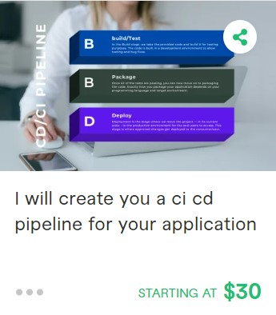
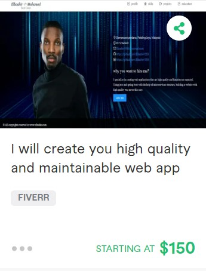

# Welcome to my GitHub, I'm Elbashir Saror -  [elbashirsaror][website] ✌️

[][youtube]

## I develop high quality and scalable web applications

- 🔭 Check out my website to view my latest projects: [my website!][website]!
- 🌱 I'm a fast learner and I'm always on the lookout for new technologies and features
- 👯 I’m looking to collaborate with other developers
- 🥅 I am available to work at any time, contact me with one of the links above, or hire me directly in [freelancer](https://www.freelancer.com/u/Elbashir1993)
- ⚡ Do not hesitate to contact me, if you encounter a problem with your code
- 😻 Check out the NFT collection I created: [CodeCats](https://opensea.io/collection/codecats?search[sortAscending]=true&search[sortBy]=PRICE&search[toggles][0]=BUY_NOW)

### The main problems that I can help you solve:

- #### Deploying websites to AWS   
   I will create you a repository, cluster, ES2 instance, service and task definition. I can also help you add/edit other servics like VPNS, ROUTE 53, S3...etc, 
- #### Build Docker Image
   I can build you a multi-stage Docker Image of your application, or help you depug issues in your docker image and make it ready for production.
- #### GitHub workflow
   You don't have to test/build/deploy your app manually, I will create a workflow for you to do all of this as a CI/CD pipeline.
- #### Create/Link Domains
  If you have a domain, I can help you link it to your S3 static website or your EC2 instance. If you don't have a domain, I can register one for you in Godaddy or   any other site of your choice.
- #### Website backend and MICROSERVICES
   If you want maintainable and scalable services or applications, microservice architecture is the best choice for such applications.
   I will build your web application as small services that run separately so that if one service breaks it won't break your website.
- #### React.js
   I am expert in this language, so if you encountered any problem in it, don't hesitate to contact me.
   I will also help you make your front end reusable and easy to debug using React.js.
- #### Ant.design
   It is the best library to use with your React.js application. It has a very attractive UI/UX and makes your code simple and organized.
- #### Other Problems
   check my skills section, and be sure I am expert in all of them, so if you face a problem that in the scope of my skills, I can help you with that too!

### My Gigs in [Fiverr](https://www.fiverr.com/elbashirelamin)

&nbsp;&nbsp;

&nbsp;&nbsp;

 

### Languages and Tools:
[][webdevplaylist]
[][reactplaylist]
[][webdevplaylist]
[][webdevplaylist]
[][cssplaylist]
[][cssplaylist]
[][webdevplaylist]
[][webdevplaylist]

[][jsplaylist]
[][webdevplaylist]
[][webdevplaylist]
[][webdevplaylist]
[][webdevplaylist]
 
 

---

### 📺 Latest YouTube Videos

<!-- YOUTUBE:START -->
- [Coinbase Hacked! $16,308 Stolen - Don’t let this happen to you!!](https://www.youtube.com/watch?v=1GJkuRa1PjM)
- [Learning to Code is NOT Hard!!](https://www.youtube.com/watch?v=5jzIjU7Ed9o)
- [12 ways to center a div](https://www.youtube.com/watch?v=WM02RIeE1Fs)
- [How to center a div 12 ways!!](https://www.youtube.com/watch?v=kphds-1V9o8)
- [JavaScript Variables](https://www.youtube.com/watch?v=oXegXhqGQ30)
<!-- YOUTUBE:END -->

➡️ [more videos...](https://youtube.com/elbashirsaror)

---

### 📕 Latest Blog Posts

<!-- BLOG-POST-LIST:START -->
- [Getting Started with MongoDB &amp; Mongoose](https://dev.to/elbashirsaror/getting-started-with-mongodb-mongoose-2h6a)
- [How To Pass Application Tracking Systems &lpar;ATS&rpar; &amp; Get Interviews - Resume Tips for Software Developer](https://dev.to/elbashirsaror/how-to-pass-application-tracking-systems-ats-get-interviews-resume-tips-for-software-developer-4bmo)
- [Microinteractions: Password Validation Animation](https://dev.to/elbashirsaror/microinteractions-password-validation-animation-5629)
- [Notion + YouTube - A Powerful Combination for Productivity](https://dev.to/elbashirsaror/notion-youtube-a-powerful-combination-for-productivity-1def)
- [Regular Expressions &lpar;RegEx&rpar; Crash Course](https://dev.to/elbashirsaror/regular-expressions-regex-crash-course-248n)
<!-- BLOG-POST-LIST:END -->

➡️ [more blog posts...](https://elbashirsaror.com)

---

  
:zap: Recent GitHub Activity

  
<!--START_SECTION:activity-->
1. 🎉 Merged PR [#120](https://github.com/elbashirsaror/minter-dapp/pull/120) in [elbashirsaror/minter-dapp](https://github.com/elbashirsaror/minter-dapp)
2. 🗣 Commented on [#120](https://github.com/elbashirsaror/minter-dapp/issues/120) in [elbashirsaror/minter-dapp](https://github.com/elbashirsaror/minter-dapp)
3. ❌ Closed PR [#191](https://github.com/elbashirsaror/create-10k-nft-collection/pull/191) in [elbashirsaror/create-10k-nft-collection](https://github.com/elbashirsaror/create-10k-nft-collection)
4. 🗣 Commented on [#191](https://github.com/elbashirsaror/create-10k-nft-collection/issues/191) in [elbashirsaror/create-10k-nft-collection](https://github.com/elbashirsaror/create-10k-nft-collection)
5. 🎉 Merged PR [#204](https://github.com/elbashirsaror/create-10k-nft-collection/pull/204) in [elbashirsaror/create-10k-nft-collection](https://github.com/elbashirsaror/create-10k-nft-collection)
<!--END_SECTION:activity-->

  
:zap: GitHub Stats

  

[website]: http://www.elbashirsaror.com
[course]: http://vsCodeHero.com
[twitter]: https://twitter.com/elbashirsaror
[youtube]: https://www.youtube.com/channel/UC-6aSmfWSxhvDHUlJ_s_juw
[instagram]: https://instagram.com/elbashirsaror
[linkedin]: https://linkedin.com/in/elbashirsaror
[webdevplaylist]: https://www.youtube.com/playlist?list=PLkwxH9e_vrAJ0WbEsFA9W3I1W-g_BTsbt
[jsplaylist]: https://www.youtube.com/playlist?list=PLkwxH9e_vrALRJKu7wfXby3MKeflhTu6B
[cssplaylist]: https://www.youtube.com/playlist?list=PLkwxH9e_vrALSdvZuEh6gqQdmDoDIoqz4
[reactplaylist]: https://www.youtube.com/playlist?list=PLkwxH9e_vrAK4TdffpxKY3QGyHCpxFcQ0
